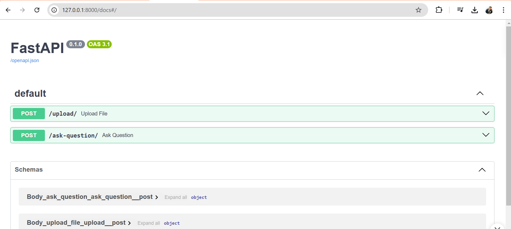
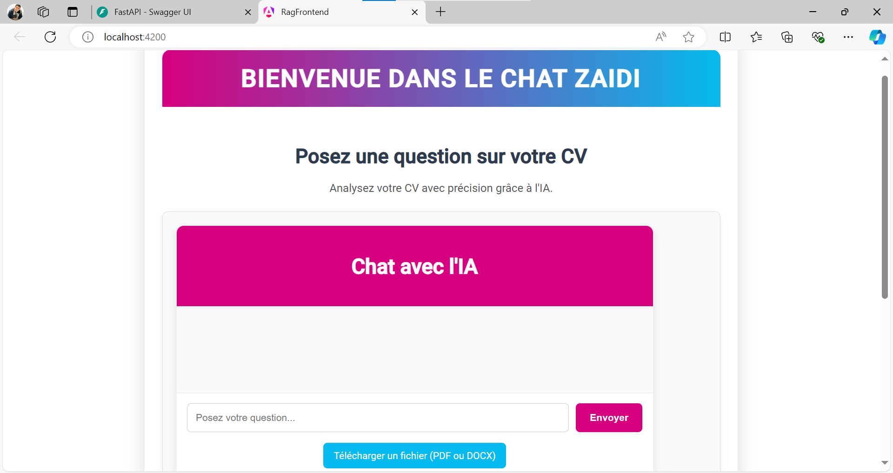
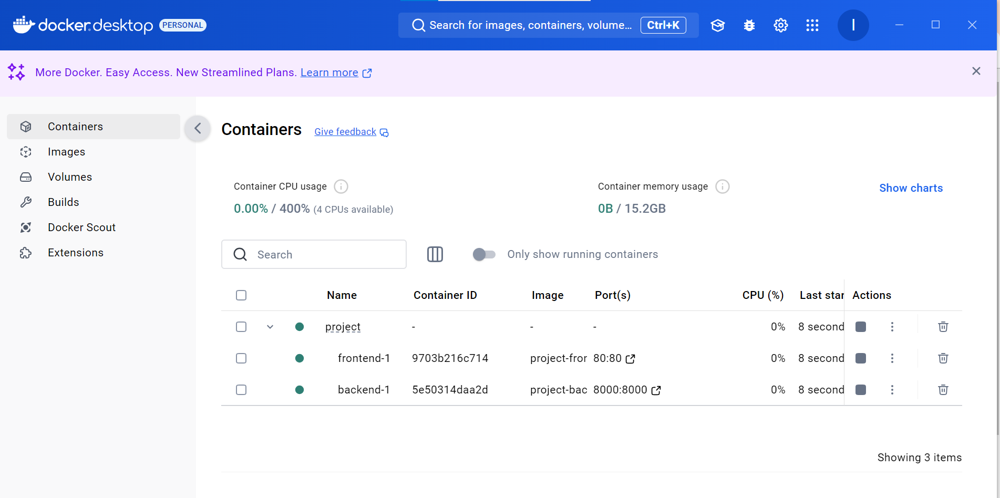

# RAG Project (Retrieval-Augmented Generation)

## Description du Projet

Le **RAG Project** (Retrieval-Augmented Generation) est une application web qui permet de télécharger des fichiers cv PDF et d'interroger ces fichiers pour obtenir des réponses à des questions spécifiques. L'application est composée de deux parties principales :

- **Backend (FastAPI)** : Gère l'upload des fichiers, le traitement des questions, et la génération des réponses à partir des fichiers PDF.
- **Frontend (Angular)** : Fournit l'interface utilisateur pour l'interaction avec l'application, permettant de télécharger des fichiers et de poser des questions.

## Table des Matières

- [Aperçu du Projet](#aperçu-du-projet)
- [Architecture du Projet](#architecture-du-projet)
- [Backend](#backend)
  - [Structure du Backend](#structure-du-backend)
  - [Installation et Démarrage](#installation-et-démarrage-backend)
  - [Endpoints API](#endpoints-api)
- [Frontend](#frontend)
  - [Structure du Frontend](#structure-du-frontend)
  - [Installation et Démarrage](#installation-et-démarrage-frontend)
- [Docker Compose](#docker-compose)
- [Contributions](#contributions)

---

## Aperçu du Projet

Le **RAG Project** est une solution permettant de télécharger des fichiers PDF et d'extraire des informations pertinentes en réponse à des questions posées par l'utilisateur. Il se compose de deux services :
- Le **frontend** est une application Angular qui permet à l'utilisateur de télécharger des fichiers cv et de poser des questions.
- Le **backend** est une API FastAPI qui gère l'upload des fichiers, l'extraction de texte à partir des fichiers PDF, et la génération de réponses basées sur ces textes.

---

## Architecture du Projet

Le projet est structuré de manière modulaire, avec une séparation claire entre le frontend et le backend. Les services sont conteneurisés à l'aide de Docker, ce qui permet une gestion simple des environnements.

### Structure des Dossiers

#### Backend (FastAPI) - `rag-backend`
- **app/api** : Contient les routes principales de l'application (upload de fichiers, gestion des questions et réponses).
  - `file_upload.py` : Gère l'upload des fichiers PDF.
  - `question_answer.py` : Gère la logique de question-réponse à partir des PDF.
- **app/models** : Contient les modèles et la logique de données.
  - `model.py` : Définition des structures et modèles nécessaires pour la gestion des fichiers et des réponses.
- **app/services** : Contient la logique métier et les services qui traitent les données.
  - `pdf_reader.py` : Extrait le texte des fichiers PDF téléchargés.
  - `qa_service.py` : Gère la logique de génération de réponses à partir des PDF.
- **main.py** : Point d'entrée de l'application FastAPI.
- **Dockerfile** : Fichier de configuration pour le conteneur Docker du backend.
- **requirements.txt** : Liste des dépendances Python nécessaires au backend.

#### Frontend (Angular) - `rag-frontend`
- **src/app/question** : Composant permettant à l'utilisateur de poser des questions.
  - `question.component.html` : Interface utilisateur pour poser une question.
  - `question.component.ts` : Logique du composant pour la gestion des questions.
  - `api.service.ts` : Service Angular pour communiquer avec le backend.
- **src/app/upload** : Composant pour l'upload des fichiers.
  - `upload.component.html` : Interface utilisateur pour le téléchargement de fichiers.
  - `upload.component.ts` : Logique associée au téléchargement de fichiers.
- **src/app/services** : Services partagés dans l'application Angular.
- **app.routes.ts** : Configuration des routes de l'application.
- **Dockerfile** : Fichier de configuration pour le conteneur Docker du frontend.

---

## Backend

### Structure du Backend
Le backend est basé sur **FastAPI**, un framework web Python, qui gère les principales fonctionnalités de l'application telles que le téléchargement de fichiers PDF, l'extraction de texte, et la génération de réponses.

#### Endpoints API
- **POST `/upload`** : Permet de télécharger un fichier cv PDF sur le serveur.
- **POST `/question`** : Permet à l'utilisateur de poser une question. Le backend génère une réponse basée sur le contenu du PDF téléchargé.

### Installation et Démarrage (Backend)
1. Clonez le dépôt :  
   ```bash
   git clone <https://github.com/IhebZaidi/RAG.git>
   cd rag-backend
   ```
2. Installez les dépendances :  
   ```bash
   pip install -r requirements.txt
   ```
3. Lancez l'application FastAPI :  
   ```bash
   uvicorn app.main:app --reload
   ```
4. Accédez à l'API : [http://localhost:8000/docs](http://localhost:8000/docs)



---

## Frontend

### Structure du Frontend
Le frontend est une application **Angular** qui offre une interface utilisateur pour interagir avec le backend. Il comprend :
- Un composant pour l'upload des fichiers PDF.
- Un composant pour poser des questions et afficher les réponses du backend.

### Installation et Démarrage (Frontend)
1. Clonez le dépôt :  
   ```bash
   git clone <https://github.com/IhebZaidi/RAG.git>
   cd rag-frontend
   ```
2. Installez les dépendances :  
   ```bash
   npm install
   ```
3. Lancez l'application Angular :  
   ```bash
   ng serve
   ```
4. Accédez à l'application : [http://localhost:4200](http://localhost:4200)

---

## Docker Compose

### Description
Le projet utilise **Docker Compose** pour faciliter la gestion des conteneurs Docker pour le frontend et le backend. 

### Fichier `docker-compose.yml`
```yaml
version: '3.8'

services:
  frontend:
    build:
      context: ./rag-frontend
      dockerfile: Dockerfile
    ports:
      - "80:80"
    networks:
      - app-network

  backend:
    build:
      context: ./rag-backend
      dockerfile: Dockerfile
    ports:
      - "8000:8000"
    networks:
      - app-network
    environment:
      - BACKEND_URL=http://backend:8000

networks:
  app-network:
    driver: bridge
```

### Démarrer avec Docker Compose
1. Placez le fichier `docker-compose.yml` dans le répertoire racine du projet.
2. Exécutez la commande suivante pour construire et démarrer les services :
   ```bash
   docker-compose up --build
   ```
3. Accédez à l'application :
   - Frontend : [http://localhost](http://localhost)
   - API Backend : [http://localhost:8000/docs](http://localhost:8000/docs)



### Arrêter les conteneurs
Pour arrêter et supprimer les conteneurs :
```bash
docker-compose down
```

---

## Contributions

Les contributions sont les bienvenues ! Si vous souhaitez contribuer, veuillez suivre ces étapes :
1. Forker le dépôt.
2. Créer une branche pour vos modifications.
3. Soumettre une pull request avec une description détaillée des modifications.
